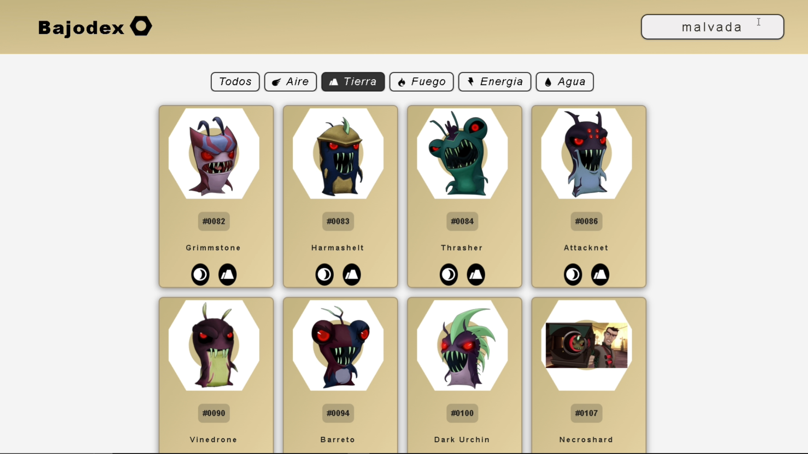

# ⚙️ Bajodex ⚙️

Proyecto desarrollado en Django que busca recrear una **Pokedex**, pero del programa animado de **Bajoterra**, de ahi su nombre, el objetivo principal del proyecto es entender el framework de django asi como el patron (MVC) 

---

## 📊 Características principales

- 📋 **Tarjetas de babosas**  
  Cada tarjeta tiene un css distinto segun el elemento de la babosa.

- 📈📉 **Filtro por elemento**  
  Filtrado segun el elemento de la babosa, cambio de css del header.

- 🔎 **Buscador**  
  Caja de buscador por tipo, elemento, numero y nombre, compatible con el filtrado.

- 📖 **Paginacion**  
  Paginacion para todas las babosas de la base de dato.

## 🛠️ Tecnologías utilizadas

- [Django](https://www.djangoproject.com/) como framework web principal
- HTML + CSS + JS para la interfaz de usuario
- Bootstrap (parcialmente) para el diseño responsivo
- SQLite como base de datos por defecto
- Django ORM para el manejo de modelos y consultas

## 📷 **Capturas**
- Principal

- Filtrado

  
  
  
  
  

- Busqueda

  
  
  

## ▶️ **Video**  

  

   

  

## 🚀 Modo de uso

1. Clona el repositorio:
  git clone https://github.com/JeisonAlexis/Bajodex-Django.git
  cd Bajodex-Django
   
2. Crea y/o activa el entorno virtual:
  python -m venv venv
  venv\Scripts\activate

3. Instala las dependencias:
  pip install -r requirements.txt

4. Aplica las migraciones:
  python manage.py migrate

5. Inicia el sevidor:
  python manage.py runserver (recuerda estar en el directorio correcto al usar este comando)

6. Accede a http://127.0.0.1:8000/ en tu navegador

**Autor**
- Jeison Alexis Rodriguez Angarita 🙍‍♂️
- Programación Orientada a Plataformas / Ingenieria de Sistemas / Universidad de Pamplona 👨‍🎓
- 2025 📅 
